# EBYTE E32 series LoRa modules

[User manual EBYTE E32 series](resources/E32_Usermanual_EN_v1.30.pdf)

## E32-868T20D

[User manual EBYTE E32-868T20D](resources/E32-868T20D_Usermanual_EN_v1.5.pdf)

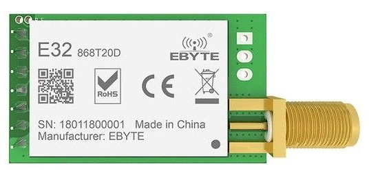

### Features
E32-868T20D is a wireless serial port module (UART) based on SEMTECH's SX1276 RF chip. It has multiple transmission modes working in the 862MHz~893MHz range (default 868MHz).

* Communication distance tested is up to 3km
* Maximum transmission power of 100mW, software multi-level adjustable;
* Support the global license-free ISM 868MHz band;
* Support air date rate of 0.3kbps~19.2kbps;
* Low power consumption for battery supplied applications;
* Support 2.3V~5.2V power supply;
* Industrial grade standard design, support -40 ~ 85 °C for working over a long time;
* SMA access point, Easy connection of coaxial cable or external antenna

### Pin layout

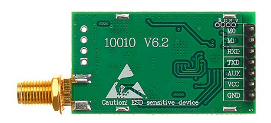

No|Pin|Description
:--:|:--:|-----------
1|M0*|Work with M1 to set 1 of 4 operating modes.
2|M1*|Work with M0 to set 1 of 4 operating modes.
3|RXD*|TTL UART input. Can be configured as open-drain or pull-up input.
4|TXD*|TTL UART output. Can be configured as open-drain or push-pull output.
5|AUX*|Indicates module’s working status. Can be configured as open-drain output orpush-pull output (floating is allowed).
7|GND|Ground.

__(*) All communication pins are 3.3V only !!!__

### Operating modes

No|Mode|M1|M0|Description
:--:|:--:|:--:|:--:|-----------
0|Normal|0|0|UART and LoRa radio are on.
1|Wake Up|0|1|Same as normal but preamble code is added to transmitted data to wake up the receiver.
2|Power Save|1|0|UART is off, LoRa radio is on WOR(wake on radio) mode which means the device will turn on when there is data to be received. Transmission is not allowed.
3|Sleep|1|1|UART is on, LoRa radio is off. Is used to get/set module parameters or to reset the module.

### Module frequency

For the E32-868T20D, the minimum frequency is 862 MHz and the maximum is 893 MHz. The working frequency of the module is set by the __channel number__. The formula is :
* __Module frequency = Minimum frequency + channel_number * 1 MHz__
The default channel number for the E32-868T20D module is 6, so the working frequency defaults to 862 MHz + 6*1 MHz = 868 MHz

### Transmission modes

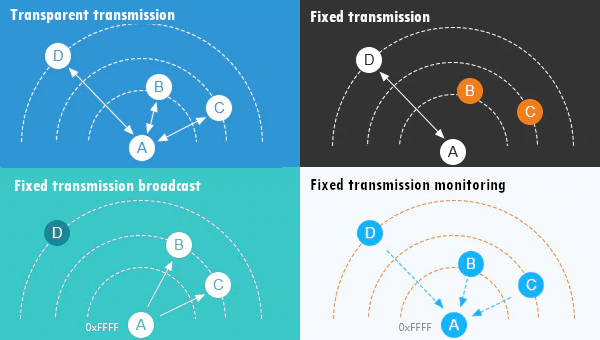 

1. __Transparent transmission__\
All modules have the same address and channel and can send/receive messages to/from each other (demo mode). The messages don't include address and channel information.

1. __Fixed transmission__\
All modules can have different addresses and channels. The transmission messages are prefixed with the destination address and channel information. If these differ from the settings of the transmitter, then the configuration of the module will be changed before the transmission. After the transmission is complete, the transmitter will revert to its prior configuration.

    - __Fixed transmission P2P__\
    The transmitted message has the address and channel information of the receiver. Only this module will receive the message. This is a point to point transmission between 2 modules.\
    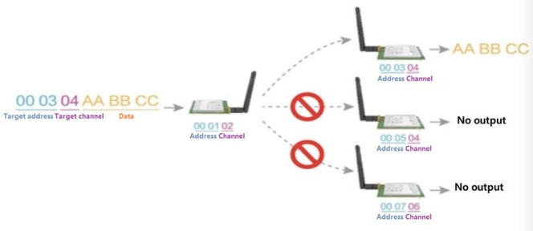

    - __Fixed transmission broadcast__\
    The transmitted message has address FFFF and a channel.  All modules with any address and the same channel of the message will receive it.\
    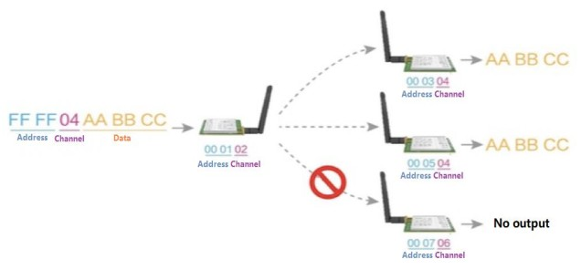

    - __Fixed transmission monitoring__\
    The receiver has adress FFFF and a channel. It will receive messages from all modules with any address and the same channel as the receiver.


### Module configuration

The module can only be configured when in __sleep operating mode__ (M0 high & M1 high). __The UART baudrate has to be 9600 and parity 8N1.__

No|Command|Description
:--:|:--:|-----------
1|C0 + config*|Set the configuration persistently. Send C0 + 5 configuration bytes in hex format.
2|C1+C1+C1*|Get the module configuration. Send 3x C1 in hex format.
3|C2 + config*|Set the configuration temporary. Send C2 + 5 configuration bytes in hex format.
4|C3+C3+C3**|Get the module version information. Send 3x C3 in hex format.
5|C4+C4+C4|Reset the module

(*) Default configuration bytes for E32-868T20D : __C0 00 00 1A 06 44__\
(**) Default version bytes for E32-868T20D : __C3 45 0D 14__

#### Configuration bytes

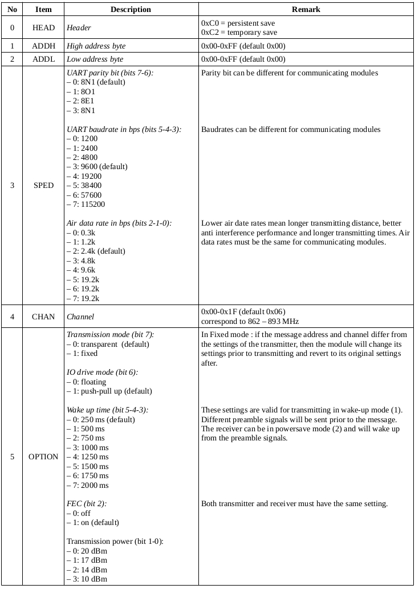

#### Version bytes

No|Item|Description|Remark
:--:|:--:|-----------|------
0|HEAD|Header|0xC3
1|FREQ|Frequency (MHz)|0x32=433, 0x38=470, 0x45=868, 0x44=915, 0x46=170
2|VERS|Version number|0x0D
3|FEAT|Features number|0x14

### Communication pins signal analysis

To make sense of the different communication pins of the E32 LoRa module, a simple [USB logic analyzer](https://www.banggood.com/USB-Logic-Analyzer-24M-8CH-Microcontroller-ARM-FPGA-Debug-Tool-p-1177821.html?rmmds=buy&cur_warehouse=CN) and an [opensource software](https://sigrok.org/wiki/PulseView) comes to the rescue :)\
I looked at these scenario's :

1. __Transparent transmission__\
The device is in normal mode (M0 and M1 both low). Some time after the message data is received on the RXD pin of the module, the AUX pin goes low. The AUX pin stays low until all data has been transmitted by the LoRa radio, after which it goes high again.
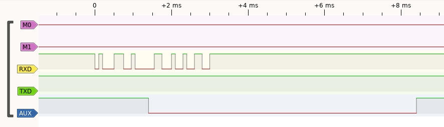

1. __Fixed transmission in normal mode__\
The device is in normal mode (M0 and M1 both low). Some time after the message data is received on the RXD pin of the module, the AUX pin goes low. The message is prefixed with the address and channel info. The AUX pin stays low until all data has been transmitted by the LoRa radio, after which it goes high again.
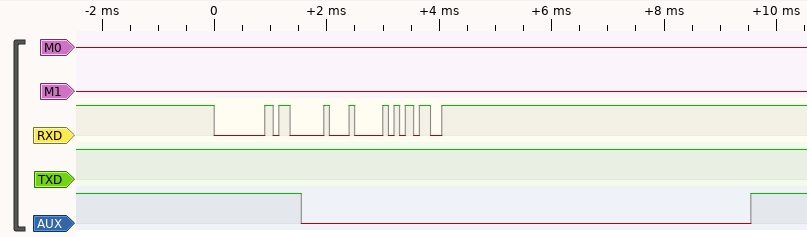

1. __Fixed transmission in wakeup mode__\
The device is in wakeup mode (M0 high, M1 low). Some time after the message data is received on the RXD pin of the module, the AUX pin goes low. The message is prefixed with the preamble wakeup signal, the address and channel info. The AUX pin stays low until all data has been transmitted by the LoRa radio, after which it goes high again.
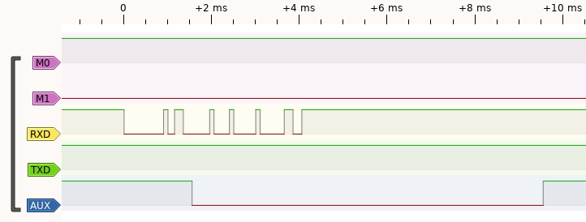

1. __Receiving__\
The device is in normal mode (M0 and M1 both low). When the LoRa radio receives a signal, the AUX pin goes low. The AUX pin stays low until all data has been sent to the TXD pin, after which it goes high again.
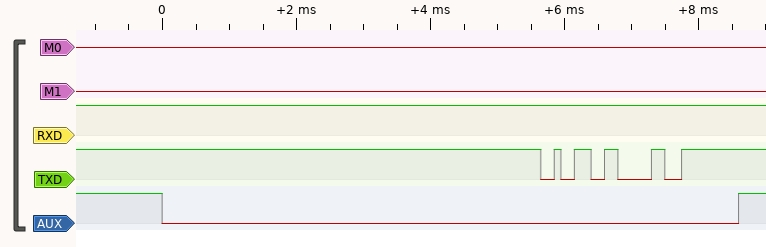

1. __Command set config with persistent save__\
The device is in sleep mode (both M0 and M1 high). Some time after the set config command is received on the RXD pin of the module, the AUX pin goes low. After the config response is sent to the TXD pin, the AUX pin goes high. 
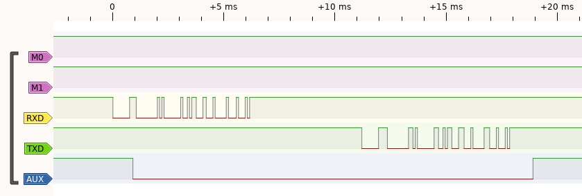

1. __Command set config with temporary save__\
The device is in sleep mode (both M0 and M1 high). Some time after the set config command is received on the RXD pin of the module, the AUX pin goes low. After the config response is sent to the TXD pin, the AUX pin goes high.
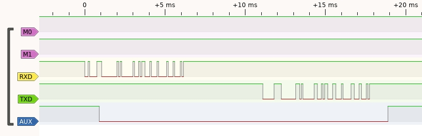

1. __Command get config__\
The device is in sleep mode (both M0 and M1 high). Some time after the get config command is received on the RXD pin of the module, the AUX pin goes low. After the config response is sent to the TXD pin, the AUX pin goes high. 
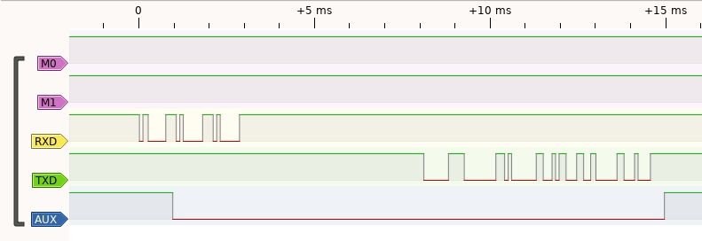

1. __Command get version__\
The device is in sleep mode (both M0 and M1 high). Some time after the get version command is received on the RXD pin of the module, the AUX pin goes low. After the version response is sent to the TXD pin, the AUX pin goes high. 
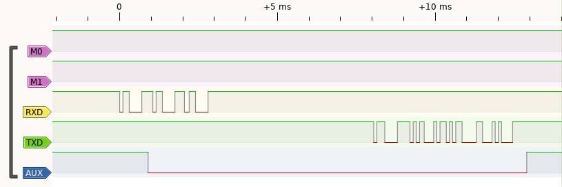

1. __Command reset device__\
The device is in sleep mode (both M0 and M1 high). Some time after the reset command is received on the RXD pin of the module, the AUX pin goes low and stays low while the device is resetting. After the module is ready again, the AUX pin goes high.\
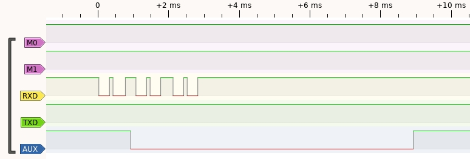

## Test setup with ESP32

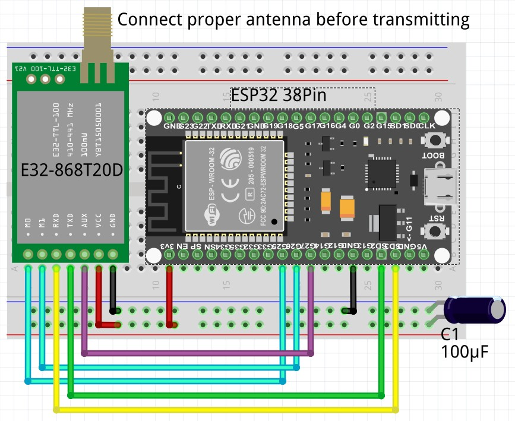


E32 Pin|Wire|ESP32 pin
:-----:|:--:|:-------:
M0|cyan|GPIO25
M1|cyan|GPIO26
RXD|yellow|SD3 (UART1-TXD)
TXD|green|SD2 (UART1-RXD)
AUX|purple|GPIO27
VCC|red|3.3V
GND|black|GND


* Because both the ESP32 and the E32 LoRa module are 3.3V compliant, no voltage dividers are necessary for communication.
* To stabilize the power supply for the E32 LoRa module, an electrolytic capacitor of 100 µF is placed on the power rail of the breadboard.

## MicroPython code

### class
```
class ebyteE32:
    ''' class to interface an ESP32 via serial commands to the EBYTE E32 Series LoRa modules '''
```
### constructor
```
def __init__(self, PinM0, PinM1, PinAUX, Model='868T20D', Port='U1', Baudrate=9600, Parity='8N1', AirDataRate='2.4k', Address=0x0000, Channel=0x06, debug=False):
    ''' constructor for ebyte E32 LoRa module '''
```

### methods
```
def start(self):
    ''' Start the ebyte E32 LoRa module '''

def sendMessage(self, to_address, to_channel, payload, useChecksum=False):
    ''' Send the payload to ebyte E32 LoRa modules in transparent or fixed mode. The payload is a data dictionary to
        accomodate key value pairs commonly used to store sensor data and is converted to a JSON string before sending.
        The payload can be appended with a 2's complement checksum to validate correct transmission.
        - transparent mode : all modules with the same address and channel of the transmitter will receive the payload
        - fixed mode : only the module with this address and channel will receive the payload;
                        if the address is 0xFFFF all modules with the same channel will receive the payload'''

def recvMessage(self, from_address, from_channel, useChecksum=False):
    ''' Receive payload messages from ebyte E32 LoRa modules in transparent or fixed mode. The payload is a JSON string
        of a data dictionary to accomodate key value pairs commonly used to store sensor data. If checksumming is used, the
        checksum of the received payload including the checksum byte should result in 0 for a correct transmission.
        - transparent mode : payload will be received if the module has the same address and channel of the transmitter
        - fixed mode : only payloads from transmitters with this address and channel will be received;
                           if the address is 0xFFFF, payloads from all transmitters with this channel will be received'''

def calcChecksum(self, payload):
    ''' Calculates checksum for sending/receiving payloads. Sums the ASCII character values mod256 and returns
        the lower byte of the two's complement of that value in hex notation. '''

def reset(self):
    ''' Reset the ebyte E32 Lora module '''

def stop(self):
    ''' Stop the ebyte E32 LoRa module '''

def sendCommand(self, command):
    ''' Send a command to the ebyte E32 LoRa module. The module has to be in sleep mode '''

def getVersion(self):
    ''' Get the version info from the ebyte E32 LoRa module '''

def getConfig(self):
    ''' Get config parameters from the ebyte E32 LoRa module '''

def decodeConfig(self, message):
    ''' decode the config message from the ebyte E32 LoRa module to update the config dictionary '''

def encodeConfig(self):
    ''' encode the config dictionary to create the config message of the ebyte E32 LoRa module '''

def showConfig(self):
    ''' Show the config parameters of the ebyte E32 LoRa module on the shell '''

def waitForDeviceIdle(self):
    ''' Wait for the E32 LoRa module to become idle (AUX pin high) '''

def saveConfigToJson(self):
    ''' Save config dictionary to JSON file ''' 

def loadConfigFromJson(self):
    ''' Load config dictionary from JSON file ''' 

def calcFrequency(self):
    ''' Calculate the frequency (= minimum frequency + channel * 1MHz)''' 

def setTransmissionMode(self, transmode):
    ''' Set the transmission mode of the E32 LoRa module '''

def setConfig(self, save_cmd):
    ''' Set config parameters for the ebyte E32 LoRa module '''

def setOperationMode(self, mode):
    ''' Set operation mode of the E32 LoRa module '''
```
[class ebyteE32 code](loraE32.py)

### test code

Transmission mode|Transmitter|Receiver
:---:|:----:|:----:
transparent|[code](testSendE32_Transparent.py)|[code](testRecvE32_Transparent.py)
|fixed P2P|[code](testSendE32_P2P.py)|[code](testRecvE32_P2P.py)
|fixed broadcast|[code](testSendE32_Broadcast.py)|[code](testRecvE32_Broadcast.py)
|fixed monitor|[code](testSendE32_Monitor.py)|[code](testRecvE32_Monitor.py)

## Proof of Concept

To validate the proper working of the ebyteE32 micropython class this simple sensor measuring scenario has been implemented :
1. __Sensor nodes__ 
    - each sensor node contains an ESP32 microcontroller, an Ebyte E32 LoRa module, a sensor and a 3.3V power supply with integrated 18650 Li-ion battery.
    - the node wakes up every 5 minutes, takes a sensor reading and transmits it with the E32 LoRa module. Then it goes to deepsleep to extend the battery life.
    - all sensor nodes transmit on the same LoRa channel, but can have different addresses.
    - sensor node 01 has a DHT11 temperature and humidity sensor ([code](SensorNodeE32_01.py))
    - sensor node 02 has a BMP180 temperature and pressure sensor ([code](SensorNodeE32_02.py))
    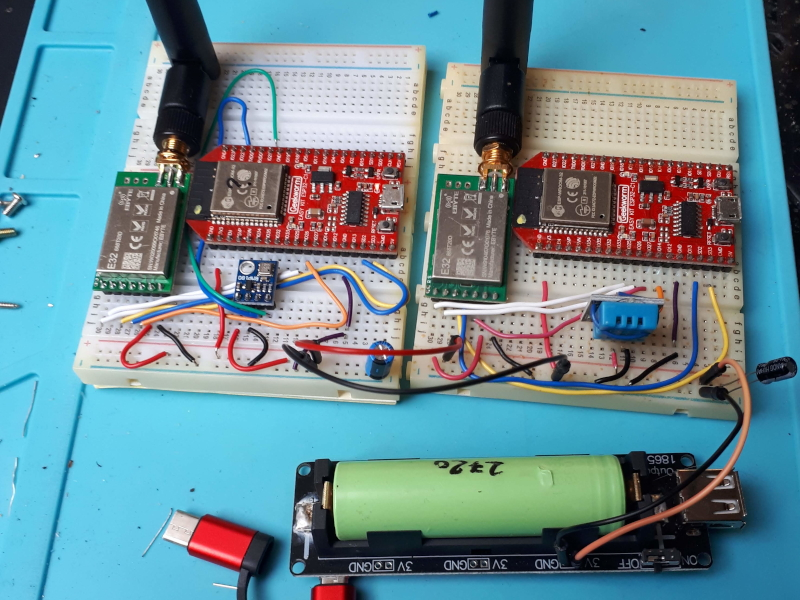

1. __Monitor node__ ([code](MonitorNodeE32.py))
    - this node contains an ESP32 microcontroller and an Ebyte E32 LoRa module. It is powered 24/7 with a 5V USB supply.
    - the E32 LoRa module is configured as a fixed monitor device (address 0xFFFF) and receives all transmissions from sensor node(s) with the same channel.
    - the incoming sensor data is stored in a Influxdb database table. The sensor data from each sensor node is stored in it's own database table.
    - the Influxdb database runs on a PC on the local network; the monitor node updates the database via a WiFi connection to the same local network.
    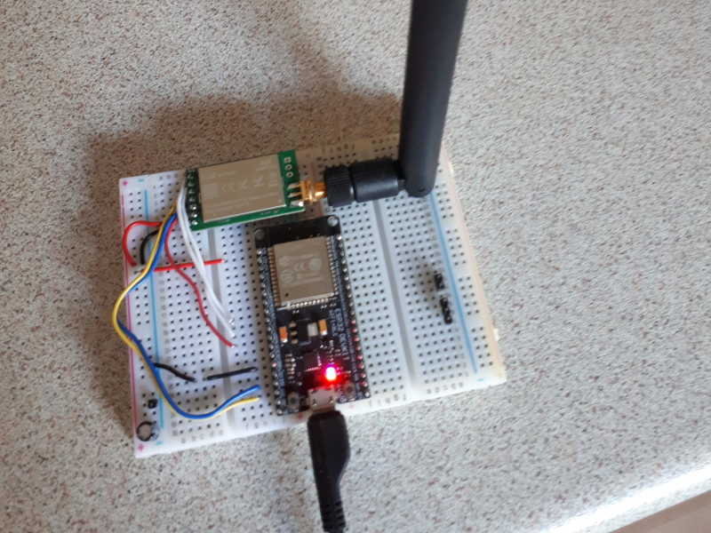
    
    ```
    Receiving fixed monitor : 
    address 1 - channel 2 - message {'pres': '101860', 'temp': '25', 'node': '02'}
    204
    ..................
    Receiving fixed monitor : 
    address 1 - channel 2 - message {'hum': '21', 'temp': '24', 'node': '01'}
    204
    ..............................................
    Receiving fixed monitor : 
    address 1 - channel 2 - message {'pres': '101852', 'temp': '25', 'node': '02'}
    204
    ..................
    Receiving fixed monitor : 
    address 1 - channel 2 - message {'hum': '20', 'temp': '25', 'node': '01'}
    204
    ..............................................
    Receiving fixed monitor : 
    address 1 - channel 2 - message {'pres': '101850', 'temp': '25', 'node': '02'}
    204
    ..................
    Receiving fixed monitor : 
    address 1 - channel 2 - message {'hum': '20', 'temp': '25', 'node': '01'}
    204
    ..............................................
    Receiving fixed monitor : 
    address 1 - channel 2 - message {'pres': '101853', 'temp': '25', 'node': '02'}
    204
    ```

1. __Influxdb server__
    - the Influxdb database server runs on a Linux Mint 19 PC on the local network.
    - __dbhost__ : IP address of Linux PC 
    - __database__ : serre_frank
    - __fields__ : time - field - value
    - __table__ : node_01 (DHT11)
    ```
        > select * from node_01
        name: node_01
        time		    field	value
        ----		    -----	-----
        1586888687213847522	    hum	        27
        1586888687213847522	    temp	12
        1586889000758763606	    hum	        27
        1586889000758763606	    temp	11
        ...
        1586951625631028963	    hum	        12
        1586951625631028963	    temp	41
        1586951939053618579	    hum	        12
        1586951939053618579	    temp	41
    ```
    - __table__ : node_02 (BMP180)
    ```
        > select * from node_02
        name: node_02
        time		    field	value
        ----		    -----	-----
        1588858703347986765     pres	101987
        1588858703347986765	    temp	26
        1588858809623716125	    pres	101992
        1588858809623716125	    temp	26
        ...
        1588871763234526547	    pres	101853
        1588871763234526547	    temp	25
        1588872076830457467	    pres	101854
        1588872076830457467	    temp	25
    ```

1. __Grafana server__
    - the sensor data from the Influxdb table(s) is visualised on a Grafana dashboard. The Grafana server is running on the same Linux Mint 19 PC on the local network.
    - __dashboard__ : Serre Frank
    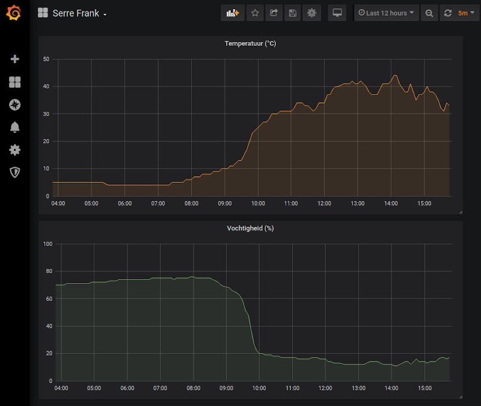
    - __panel 1__ : Temperature\
    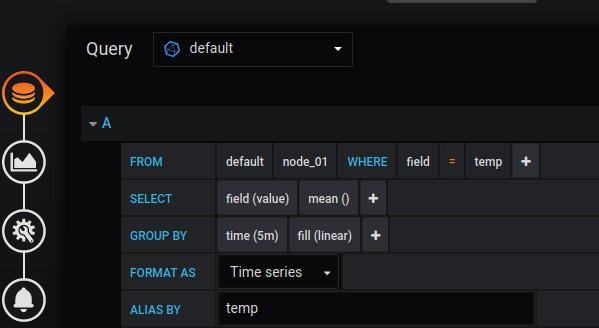
    - __panel 2__ : Humidity\
    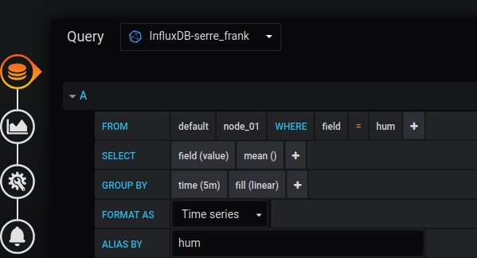
    - __panel 3__ : Pressure\
    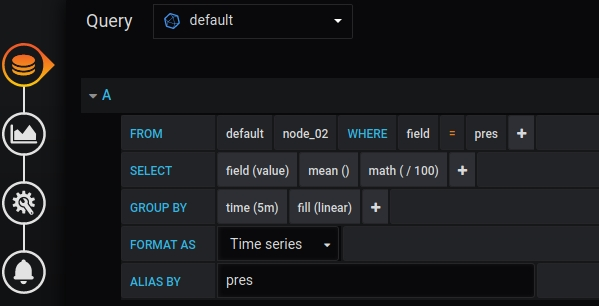

